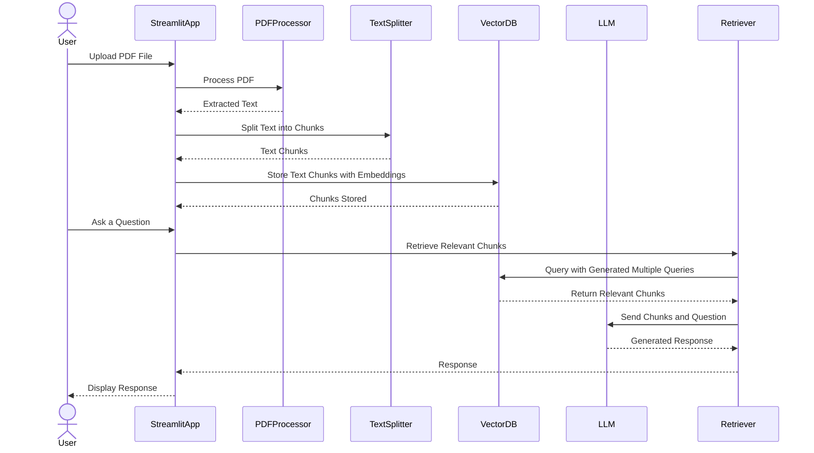

# Chatbot Application

## Table of Contents
1. [Introduction](#introduction)
2. [Flow Diagram](#flowdiagram)
3. [Features](#features)
4. [Architecture](#architecture)
5. [Requirements](#requirements)
6. [Setup and Installation](#setup-and-installation)
7. [Usage](#usage)
8. [Components Explanation](#components-explanation)
9. [Future Enhancements](#future-enhancements)

## Introduction

This project is a chatbot application that processes PDFs and answers questions using a Retrieval-Augmented Generation (RAG) approach. It includes functionality for handling PDF documents, text splitting, and integration with external APIs.

- **Input**: PDF file.
- **Output**: Responses to user questions based on the content of the uploaded PDF.

---

---

## flowdiagram:

---

## Features

- **PDF Text Extraction**: Extracts text from PDF files.
- **Text Chunking**: Splits long texts into manageable chunks for processing.
- **Embeddings**: Uses `OllamaEmbeddings` to create text embeddings.
- **Vector Database**: Utilizes `Chroma` for storing and retrieving document chunks.
- **LLM Integration**: Powered by Ollama's `ChatOllama` model for generating natural language responses.
- **Interactive Web Interface**: Simple UI using Streamlit for PDF upload and query interaction.
- **Multi-query Retrieval**: Enhances question-based retrieval by generating multiple query versions.
- **Database Cleanup**: Cleans up vector database when no longer needed.

---

## Architecture

The system follows a modular architecture with the following key components:

1. **Text Extraction**: Extracts text from the uploaded PDF using `PyPDF2`.
2. **Text Splitting**: Splits the extracted text into smaller chunks using Langchain's `RecursiveCharacterTextSplitter`.
3. **Embedding**: Converts text chunks into embeddings using `OllamaEmbeddings`.
4. **Vector Database**: Stores the embeddings in `Chroma` for efficient document retrieval.
5. **Language Model**: Utilizes `ChatOllama` for question-answering based on retrieved document chunks.
6. **Retrieval**: Uses `MultiQueryRetriever` to enhance document retrieval by generating multiple query versions.
7. **UI**: Provides a Streamlit-based web interface for uploading PDFs and asking questions.

---

## Requirements

- Python 3.8 or higher
- Pip package manager

### Python Libraries

- `os`
- `PyPDF2`
- `streamlit`
- `langchain`
- `langchain_community`
- `Chroma`
- `OllamaEmbeddings`

---

## Usage

1. **Upload PDF**: 
   - On the web interface, click the "Choose a PDF file" button to upload a PDF file.
   
2. **Ask a Question**: 
   - Once the PDF is processed, type your question in the text input box and press "Get Answer". The system will respond based on the content of the PDF.

3. **Cleanup**: 
   - Click the "Cleanup" button to delete the vector database and free up resources after usage.

---

## Components Explanation

1. **`process_pdf(file)`**:
   - This function handles PDF text extraction using `PyPDF2`, splits the extracted text into chunks, generates embeddings using `OllamaEmbeddings`, and stores them in a `Chroma` vector database.

2. **`ChatOllama` Model**:
   - Used for natural language processing to generate responses based on retrieved chunks from the vector database.

3. **`RecursiveCharacterTextSplitter`**:
   - Splits large text into smaller chunks for embedding and storage, improving retrieval accuracy and performance.

4. **`Chroma` Vector Database**:
   - A high-performance vector database used to store and retrieve document chunks based on their similarity to the input query.

5. **`MultiQueryRetriever`**:
   - Generates multiple versions of the user's question to improve retrieval accuracy by querying the database from different perspectives.

6. **Streamlit Interface**:
   - Simple web interface for uploading PDFs and interacting with the system.

---

## Future Enhancements

- **Multi-Language Support**: Extend the chatbot to support text in languages other than English.
- **Additional File Formats**: Support for DOCX, TXT, and other file types.
- **Improved Chunking**: Implement more sophisticated text chunking techniques for better context management.
- **LLM Customization**: Allow users to select different language models for question answering.

---

